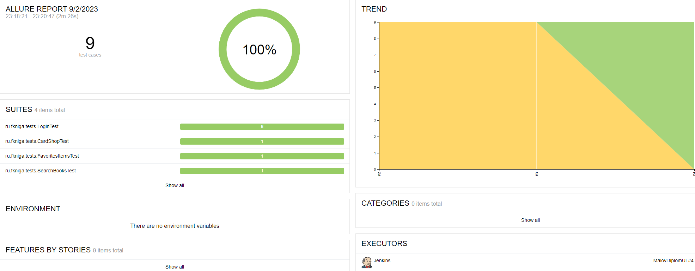

# Diplom_UI

Проект по автоматизации тестирования для ресурса [fkniga.ru](https://fkniga.ru/)

> fkniga.ru - интернет магазин по продаже книг, канцелярии и подарков


## Реализованные проверки:
* Успешная авторизация
* Различные вариант неуспешной авторизации
* Выход из аккаунта
* Поиск товара
* Добавление товара в корзину
* Добавление товара в избранное 

____
## Технологии и инструменты:
<p align="center">


</p>


## **Параметры сборки в Jenkins:**

- *BROWSER (браузер, по умолчанию chrome)*
- *BROWSER_SIZE (размер окна браузера, по умолчанию 1920x1080)*
- *TESTS_TAG (выбор тестов для запуска, по умолчанию запуск всех тестов - test)*

<a id="console"></a>
## Команды для запуска из терминала
___
#### Локальный запуск:
```bash  
gradle clean test 
```

#### Удаленный запуск тестов с параметрами:

```bash
gradle clean test
-DbaseUrl=${BASE_URL}
-DbrowserVersion=${BROWSER_VERSION}
-DbrowserSize=${BROWSER_SIZE}
-DselenoidUrl=${SELENOID_URL}

```

> `${BROWSER}` - наименование браузера (_по умолчанию - <code>chrome</code>_).
>
> `${BROWSER_VERSION}` - версия браузера (_по умолчанию - <code>100.0</code>_).
>
> `${BROWSER_SIZE}` - размер окна браузера (_по умолчанию - <code>1920x1080</code>_).
>
> `${REMOTE_URL}` - адрес удаленного сервера, на котором будут запускаться тесты.
___
<a id="allure"></a>
## </a> <a name="Allure"></a>Allure [отчет](https://jenkins.autotests.cloud/job/MalovDiplomUI/4/allure/)</a>
___


<p align="center">  
  
</p>  
